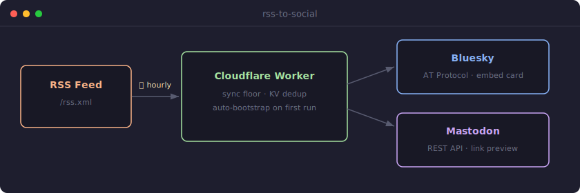

# rss-to-social



Automatically syndicate your RSS feed to **Bluesky** and **Mastodon**. Runs on Cloudflare Workers as a scheduled cron job.

> **Dev.to:** has native RSS import built in. Go to [dev.to/settings/extensions](https://dev.to/settings/extensions) to connect your feed directly. Posts land as drafts for review before publishing.

## Features

- Polls any RSS 2.0 feed on a configurable cron schedule
- Posts to **Bluesky** with a rich link card (OG title, description, thumbnail via AT Protocol embed)
- Posts to **Mastodon** with title, excerpt, and link
- Deduplicates via Cloudflare KV — each post syndicates exactly once
- Auto-bootstraps on first run: records a sync floor so existing posts are never published
- Adapters are optional — configure only the platforms you want

## Prerequisites

- [Cloudflare account](https://cloudflare.com) (free tier sufficient)
- [Wrangler CLI](https://developers.cloudflare.com/workers/wrangler/install-and-update/) installed and authenticated (`wrangler login`)
- Node.js 22+

---

## Setup

### 1. Clone and install

```bash
git clone https://github.com/devenney/rss-to-social.git
cd rss-to-social
npm install
```

### 2. Run setup

```bash
npm run setup
```

Creates both KV namespaces and generates `wrangler.personal.toml` with the IDs filled in. This file is gitignored and never committed.

### 3. Fill in `wrangler.personal.toml`

```toml
[vars]
RSS_FEED_URL = "https://your-site.com/rss.xml"
BLUESKY_HANDLE = "you.bsky.social"
MASTODON_INSTANCE = "mastodon.social"
```

### 4. Obtain credentials

- **Bluesky:** [bsky.app/settings/app-passwords](https://bsky.app/settings/app-passwords) → Add App Password
- **Mastodon:** `https://[instance]/settings/applications` → New Application, tick `write:statuses`

### 5. Set secrets

```bash
npm run secrets
```

Prompts for `BLUESKY_APP_PASSWORD` then `MASTODON_TOKEN`. Secrets are stored in Cloudflare and never appear in any file.

### 6. Deploy

```bash
npm run deploy
```

The worker auto-bootstraps on its first cron tick.

---

## How auto-bootstrap works

On first run the worker records the current timestamp as a **sync floor**. Posts published before that time are permanently skipped — protecting against back-catalogue flooding on initial deploy.

Seen post GUIDs are tracked in KV to prevent duplicates after the floor.

If the KV namespace is ever wiped, the sync floor resets on the next run. To backfill from a specific date:

```bash
npm run bootstrap -- --from=2026-01-01
```

---

## Re-syndicating a missed post

```bash
npm run nudge -- --url=https://your-site.com/blog/the-missed-post
```

Removes the post's GUID from KV. The next cron tick re-syndicates it.

---

## GitHub Actions

CI (lint → typecheck → tests) runs on every push and pull request. Deployment and releases trigger automatically when CI passes on `main`.

Add these secrets to your GitHub repository (**Settings → Secrets and variables → Actions**):

| Secret | How to get it |
|---|---|
| `CLOUDFLARE_API_TOKEN` | Cloudflare dashboard → My Profile → API Tokens → "Edit Cloudflare Workers" template |
| `CLOUDFLARE_ACCOUNT_ID` | Cloudflare dashboard → any Workers page → right sidebar |
| `KV_NAMESPACE_ID` | Production KV namespace ID (from `npm run setup`) |
| `RSS_FEED_URL` | Your feed URL |
| `BLUESKY_HANDLE` | Your Bluesky handle |
| `MASTODON_INSTANCE` | Your Mastodon instance hostname |

Releases are tagged automatically by [semantic-release](https://semantic-release.gitbook.io) from [conventional commits](https://www.conventionalcommits.org/).

---

## Configuration reference

### Cron schedule

Edit `wrangler.personal.toml`:

```toml
[triggers]
crons = ["0 * * * *"]   # hourly; adjust to taste
```

### Adding an adapter

1. Implement `SocialAdapter` from `src/ports/social.ts`
2. Add tests in `test/adapters/`
3. Register in `src/config.ts`

---

## Local development

```bash
npm run dev        # wrangler dev with wrangler.personal.toml
npm test           # tests run in Workers runtime, no network calls
npm run lint
npm run typecheck
```

---

## License

MIT
